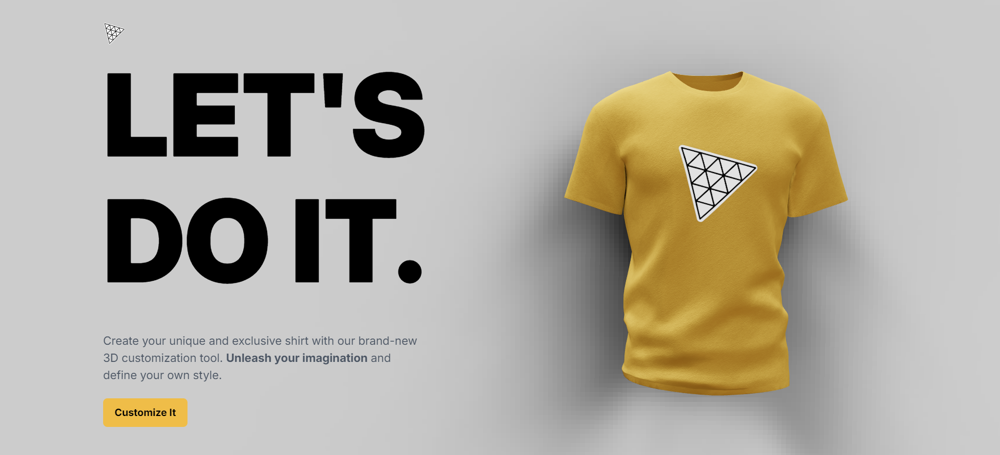
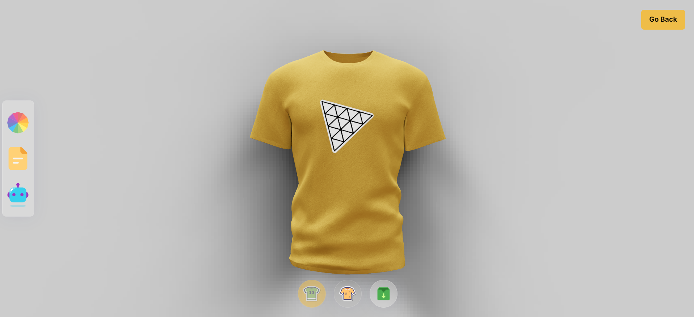

# 👕 3D Product

[](https://github.com/MarkiyanCh1/3D-PRODUCT-SHOP)

Create your unique and exclusive shirt with our brand-new 3D customization tool. <strong>Unleash your imagination</strong> and define your own style. Use AI to create unique logo and shirt colors. And download your new `Super Shirt`. The 3D product website also provides users with an intuitive and user-friendly interface that facilitates easy navigation and smooth interaction with the platform. The website is optimized for a seamless user experience and features a responsive design that ensures compatibility across all devices.

## 🌐 Live Website

- The application is live and hosted on Vercel. You can access it [here](https://3d-tshirt-shop.vercel.app/).

## 📸 Screenshot

- Home Page
  

- Image Create Page
  

## 🌟 Features

- Use our shirt model
- Choose color you like.
- Upload your images for logo and textures for your shirts.
- Use AI to generate cool and unbelivable logos and textures.
- Save your shirt and Share it with others
- Download your shirt to your computer any time

## 📄 Pages

1. **Home Page**: The landing page of our cool app.
2. **Create Page**: The page where the magic happens.

## 🛠️ Technologies Used

- **React**: A JavaScript library for building user interfaces, used latest React 18 features.
- **NodeJS**: A JavaScript runtime environment used to build server-side applications and APIs.
- **OpenAI**: A powerful AI system that generates realistic images and art from text descriptions.
- **ThreeJS**: A powerful JavaScript library for creating 3D graphics and animations in web browsers.
- **React-Three-Fiber**: A library that bridges the gap between Three.js and React, allowing to build 3D scenes.
- **React-Three-Drei**: A collection of additional components and utilities providing a wider range of functionalities for creating 3D experiences.
- **TailwindCSS**: A utility-first CSS framework that provides a rapid way to style web applications.
- **Valtio**: A lightweight state management library that integrates well with React, potentially used for managing state within 3D components.

## 🚀 Installation

To install and run this project locally on your machine, follow the steps below.

1. Clone the repository:

```bash
git clone https://github.com/MarkiyanCh1/3D-PRODUCT-SHOP.git
```

2. Navigate into the project directory:

```bash
cd 3D-PRODUCT-SHOP
```

**Set Up Environment Variables**

Create a new file named `.env` in the root of your project and add the following content:

```env
OPENAI_API_KEY
```

3. Navigate into the server file:

```bash
cd server
```

4. Install the server dependencies:

```bash
npm install
```

5. Start server:

```bash
npm start
```

The server will starte on port 8080 and connect mongoDB

6. Return into the project deirectory:

```bash
cd ..
```

7. Navigate into the client file:

```bash
cd client
```

8. Install the client dependencies:

```bash
npm install
```

9. Start the application:

```bash
npm run dev
```

The application will start running on http://localhost:5173.
npm

## 🤝 Contributing

Contributions are welcome! Please open an issue or submit a pull request.

---

## If you find this project useful, please consider giving it a star ⭐. Your support is greatly appreciated!

Happy coding! 💻
